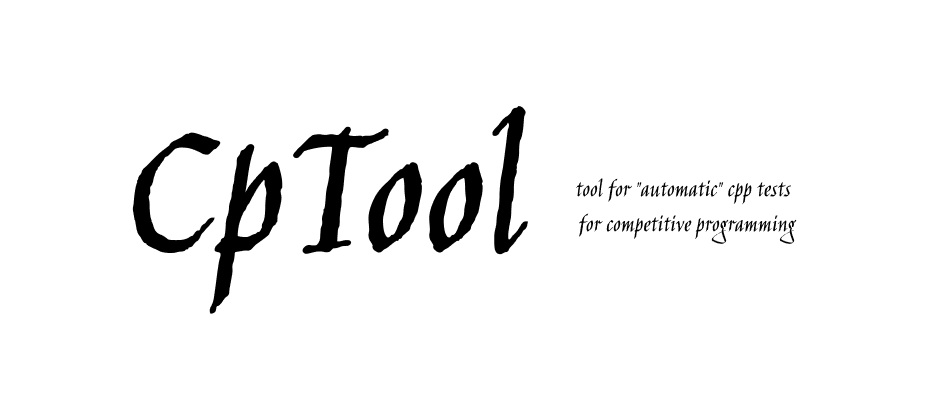

<p align="center">
  
</p>

# cptool
This repository hosts the code for cptool, a tool to "automate" cpp tests for competitive programming

### Mode of use:
Clone the repository to the path you want, then there are several ways to run it:

1. Use `python cptool <filename>`  without the .cpp file extension, cptool will take care of compiling and testing your code. Make sure you have the test.txt file with the answer to your program, you can use the codeforces examples.


2. Use `chmod +x` to make the file executable, then just do cptool <filename>, remember that every time you do this if cptool is not in the same folder you want to use it in you have to provide the path where it is located.

3. The last way is to do `chmod +x` but move the executable to the `/usr/local/bin` folder so you can run cptool from anywhere, if you want you can run the `make.sh` file (with sudo) to do this for you. 

Then if you want to try the tool you can execute the tool in the example directory.

**Don't forget to have the preprocessor directive to receive inputs and write the program output to a file:**
``` C
#ifndef ONLINE_JUDGE
  freopen("input.txt", "r", stdin);
  freopen("output.txt", "w", stdout);
#endif
```
